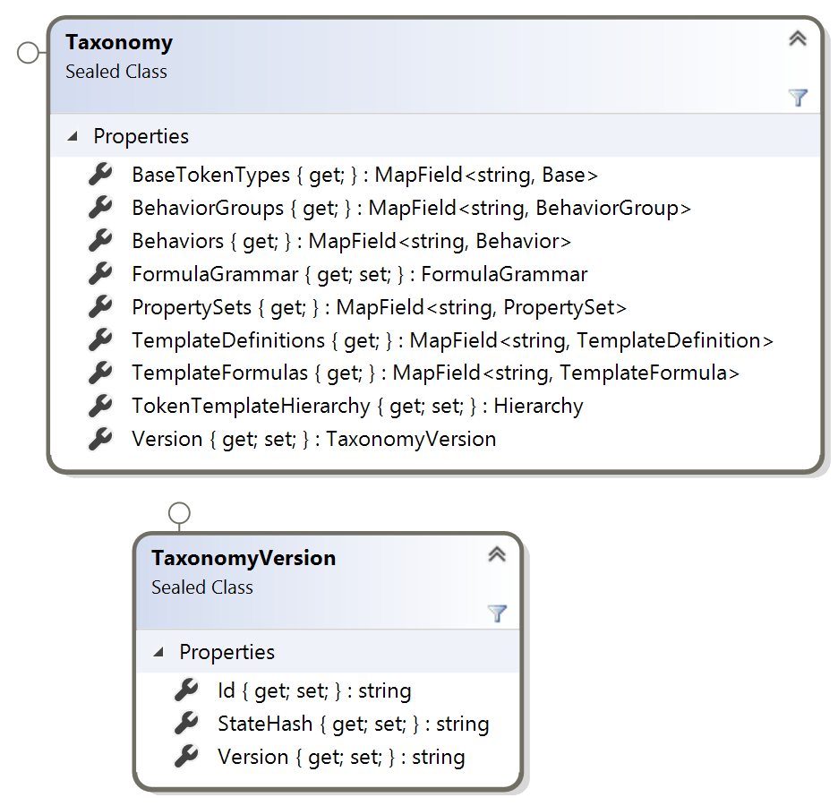

# Taxonomy Object Model (TOM) Guide

The TTF is comprised of artifacts that represent the components used to define a token template and specification. The TOM contains collections of TTF artifact types grouped together. There is a collection for Token Bases, Behaviors, Behavior Groups, Property Sets, Template Formulas and Template Definitions. The TOM also has a hierarchical layout of Token Templates and Specifications.

The TOM is persisted to the [artifacts](../artifacts) folder and is loaded, saved and provided by the [TaxonomyService](../tools/TaxonomyService) and should be the primary programmatic access to the TTF.

To understand how to obtain the TOM using a gRpc call and to create, update and delete artifacts, see [Taxonomy Services](taxomonyServices.md).

The TOM is defined in the [protos](protos) folder in a set of protocol buffer files that are compiled into libraries for popular platforms like .Net, Java, Go, TypeScript, etc. in the [TOM](../tools/TaxonomyObjectModel) folder. The `protoc` creates the libraries using the `build-model.sh` bash script.  Note, you may need to adjust the path to the `protoc` and `grpcPluggin` folders for your local install.

## Taxonomy

The Taxonomy Object is the parent or container object that holds all of the collections of artifacts. You can request from the Taxonomy Service to obtain the entire TOM or you can request specific artifacts using their unique identifiers or tooling symbols. Unless memory constrained or the TTF grows too large, it is recommended that the client request the full TOM and work with the the TOM locally sending individual artifacts to be updated back to the service to be persisted to the artifacts folder.

The Taxonomy is represented by a version, supporting potential side by side major versions of the TTF in the future.

## Taxonomy Object

The TOM root object is Taxonomy, which has a `TaxonomyVersion` property, key/value collections of artifacts by type, a Hierarchy of templates and a token formula grammar.



Above are the collections, represented in the native language, in this case C# as a MapField, with the artifact Id as the key string and the object of the collection type as the value.

## Taxonomy Hierarchy

The TOM, when it is retrieved from the [artifacts](../artifacts) folder will build a default hierarchy of token templates by their classification. This is a dynamic hierarchy that is not persisted and can be changed at runtime.

This is useful for user interfaces that want to represent a visual hierarchy. The hierarchy can be adjusted and rebuilt based on a user's input without connecting with the Taxonomy Service.


## Artifact Type Collections

Each artifact type is place within a collection where the key is the artifact Id and the value is the object of that type.


Any artifact can be fetched by their ArtifactId, using the key property, or looped through using the items collection.

## Artifact

Every Artifact has an Artifact property, which holds the common schema and data elements for the TTF. The Artifact property or object is the 1st property defined in the artifact type description.

```proto
message Behavior{
    taxonomy.model.artifact.Artifact artifact = 1;
    bool is_external = 2;
    ...
```

Each Artifact has an ArtifactSymbol that contains unique properties for the Artifact and it is the 1st property of every Artifact.

```proto
message Artifact {
    ArtifactSymbol artifact_symbol = 1;
    string name = 2;
    repeated string aliases = 3;
    ...
```

The ArtifactSymbol has a globally unique identifier, currently a GUID or UUID, for the artifact itself regardless of its type.  In the ArtifactSymbol other properties are defined to assist with visual tooling and formulas as well as human readable versioning fields. Only the Id itself MUST be unique, other fields may have conflicts at runtime like a ToolingSymbol but not cause the Artifact Object to be invalid.  

```proto
message ArtifactSymbol{
    string id = 1; //unique identifier GUID/UUID - should be generated when the artifact is created. Must be unique throughout the framework.
    ArtifactType type = 2;
    string visual = 3; //symbol for single artifact and formula for templates
    string tooling = 4; //symbol for single artifact and formula for templates
    string version = 5; //for visualization, not guaranteed to be accurate.
    bool template_validated = 6; //for templates only
}
```


## Navigation

The TOM contains many objects that are nested together in relationships. To support runtime navigation, child or hosted objects will have a placeholder for its runtime parent, to support automated or tooling navigation. The TaxonomyService will construct the artifact's objects and their relationships placing a reference to a child object's parent in a typed parameter in the child.

For example, the ArtifactSymbol is a child of the Artifact and will contain an artifact property that references its parent.

The references are optional and may not be constructed depending on how the object was fetched from the service.

## Artifact Types

There are 6 types of artifacts, called `Typed Artifacts` that are persisted in the TTF. They are:

- TokenBase: A base token type with some initial characteristics like Fungible or Non-Fungible and Subdivision.
- Behavior: A defined capability or restriction that a token could implement.
- BehaviorGroup: A commonly used together set of behaviors that can go together and need to be configured in context together.
- PropertySet: A non-behavior data property that a token will have.
- TemplateFormula: A list of ingredient artifacts that a token has. This is used to classify a token in a hierarchy and to generate a TemplateDefinition from.
- TemplateDefinition: A recipe for implementing to token. It is initially generated by a formula that lists each artifact as an ingredient. The definition then creates a `Typed Artifact Reference` where context specific values for behaviors and property-sets as well as token base values like decimals to subdivide by are set. The Template Definition is where all the artifacts come together and the definition completed. A Token Specification is generated from the TemplateDefinition, whose ArtifactId becomes the Token Specification Id.

## Objects to prevent data duplication

A Typed Artifact, like a Behavior, is essentially a read-only recipe. When it is used the Artifact itself is not modified, but a reference type to the artifact.

A TemplateFormula will use an Template Reference, i.e. TemplateBehavior or TemplatePropertySet of its type that contains the ArtifactSymbol reference of the artifact being used. It is only a pointer to the artifact and it does not specify values.

A TemplateDefinition uses Typed References, like a BehaviorReference or a PropertySetReference, where the values for the artifact referenced can be supplied without modifying the actual artifact itself.

A TokenSpecification uses a Typed Specification, like a BehaviorSpecification or PropertySetSpecification, that is dynamically generated from the Typed References in the TemplateDefinition. 

## Token Specification

A Token Specification is generated using a TemplateDefinition by merging the artifact referenced in the Typed Reference in the definition and merging the values with the Artifact referenced into a Typed Specification artifact like a BehaviorSpecification. Values set in the ArtifactReference become the values set in the specification.


## Working locally with the TOM

The TOM is designed for composition, specifically to design new token templates from the collections of artifact types. Existing artifacts can be edited simply by updating any of their properties, except for the Artifact.Id which should not be changed unless there is a conflict with another artifact in the TOM.

Updating the text value of any of the properties will only reside within your local TOM until it is submitted to the TaxonomyService for updating the underlying json maintained in the git repo. These updates are stored on your local git branch and can be pushed to the git repo and submitted using a pull request to be included in the TOM globally. This isolates any changes made to the TOM locally and those changes are tracked locally and remotely using git. So if any mistakes are made, the changes can be rolled back. Regular git `commit` will allow you to modify safely with incremental updates and rollbacks if needed.

### New Artifacts

You can create any new artifact simply by creating a new object instance of the type. Any new type should be assigned a `type.Artifact.ArtifactSymbol.Id` GUID/UUID before being committed or pulled and a unique Visual and Tooling symbol based on their type and a common name, see [taxonomy](../token-taxonomy.md) for details on names and symbols.

New artifacts can should be submitted to the TaxonomyService to be persisted to the artifacts repo to be saved periodically to prevent data loss in memory if the application creating the object becomes unresponsive.

## Single and Compound Artifacts

Single artifacts, TokenBase, Behavior and PropertySet, are the simplest artifacts and are not concerned with other artifacts, other than listing dependencies, incompatibilities and influences which are just ArtifactSymbol references indicating that a relationship with the other artifact exists.

Compound artifacts like BehaviorGroup, TemplateFormula and TemplateDefinition are more complex. Of these the TemplateFormula has the least detail, but many references.

## TemplateFormula

A TemplateFormula is a collection of artifact ingredients that are mixed together to provide the potential functionality of any definition based off of. It is primarily used to perform ingredient level validation ensuring that conflicting symbols are not allowed using the taxonomy rules. This prevents TemplateDefinitions based off the formula from introducing artifacts that are not listed in the TemplateFormula that would not be valid. 

Creating a new TemplateFormula is just like creating any other new artifact, giving it a unique Id and name, but your may wait until after design to determine the symbol as it is a compound formula. A TemplateFormula can be a Single or Hybrid token and for each token it defines a TemplateBase, a Base token type, then the individual artifacts from the collections of behaviors, groups and property sets. These are recorded in the template using ArtifactSymbol references, which do not have any detail about how the reference is used, just that it is an ingredient.

From this list of artifacts included, a `TemplateFormula.Artifact.ArtifactSymbol.Tooling` symbol and it corresponding Visual symbol can be built and validated using the [taxonomy rules](../token-taxonomy.md).

Submit the formula for persistance to the TaxonomyService before proceeding to defining a TemplateDefinition.

## TemplateDefinition

A TemplateDefinition must be created using a TemplateFormula. The TaxonomyService will create and initialized a TemplateDefinition when provided with the `TemplateFormula.Artifact.ArtifactSymbol.Id` source formula and return it to you as a TemplateDefinition object. The TaxonomyService builds the TemplateDefinition object from the references in the formula and the referenced artifact values and settings that can be altered in the TemplateDefinition.

Modify and add property values in the TemplateDefinition to complete the definition of the TokenTemplate that is used to create the TokenSpecification. This is the last part of the composition where specific token settings like decimal places, role names, influences and invocations can be customized for the specific token. The TemplateDefinition will preserve the parent TemplateFormula reference.

The `TemplateDefinition.Artifact.ArtifactSymbol.Id` is also the TokenSpecification id and the `TemplateDefinition.Artifact.Name` becomes the name for the TokenSpecification and Template.

Send the updated object to the TaxonomyService to persist it to local storage. You can then print the TokenSpecification from the TaxonomyPrinter using the `TemplateDefinition.Artifact.ArtifactSymbol.Id` as input and it will generate the openXML output for your specification to review. To update the specification, you must update and persist the TemplateDefinition. Updates to the openXML document will be overwritten when the definition is printed again.
